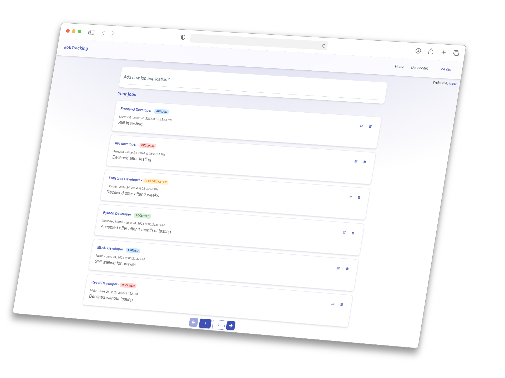

# Job Application App

Track all your job applications in one place!

_You can preview this project **[here](https://job-tracking-five.vercel.app/)**_

## Screenshots

## Tech stack

## Run this project locally

**NPM example**

- Clone this repository: `git clone project-name`
- Install dependencies: `npm i`
- Create `.env.local` file in root directory of the project and add your Supabase keys
- Run: `npm run dev`

_Note: You need to have default auth table in supabase with following fields for jobs table:_

- `id` => _int8_
- `created_at` => _timestamp_
- `user_id` => _uuid (Foreign key)_
- `job_title` => _varchar_
- `company` => _varchar_
- `description` => _text_
- `status` => _text_

## Environment Variables

To run this project, you will need to add the following environment variables to your .env.local file

`NEXT_PUBLIC_SUPABASE_URL`

`NEXT_PUBLIC_SUPABASE_ANON_KEY`

## License

[MIT](https://choosealicense.com/licenses/mit/)

## Authors

- [NikolaDev](https://github.com/Nikoraii)
